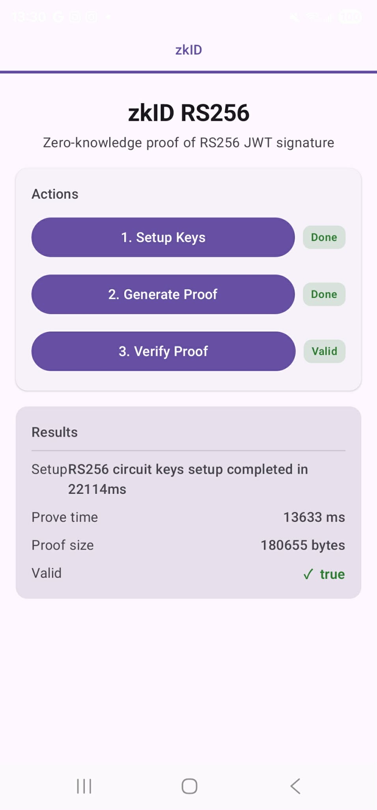

# OpenAC Android Example

An Android example app demonstrating zero-knowledge proof generation and verification using [OpenACKotlin](https://github.com/zkmopro/OpenACKotlin).

## Screenshot



## Overview

This app uses [OpenACKotlin](https://github.com/zkmopro/OpenACKotlin) to run the zkID RS256 circuit on Android. It downloads the circuit file (`rs256.r1cs`) at runtime, then walks through the three-step ZK workflow:

1. **Setup Keys** — generates proving and verifying keys from the circuit
2. **Generate Proof** — produces a zero-knowledge proof from the input
3. **Verify Proof** — verifies the proof is valid

## Getting Started

Clone the repo and open it in Android Studio. The app requires an internet connection on first launch to download the `rs256.r1cs` circuit file from the [zkID releases](https://github.com/zkmopro/zkID/releases).

```bash
git clone https://github.com/zkmopro/OpenACAndroidExample
```

## Dependencies

- [OpenACKotlin](https://github.com/zkmopro/OpenACKotlin) — Kotlin bindings for the mopro ZK proving backend
