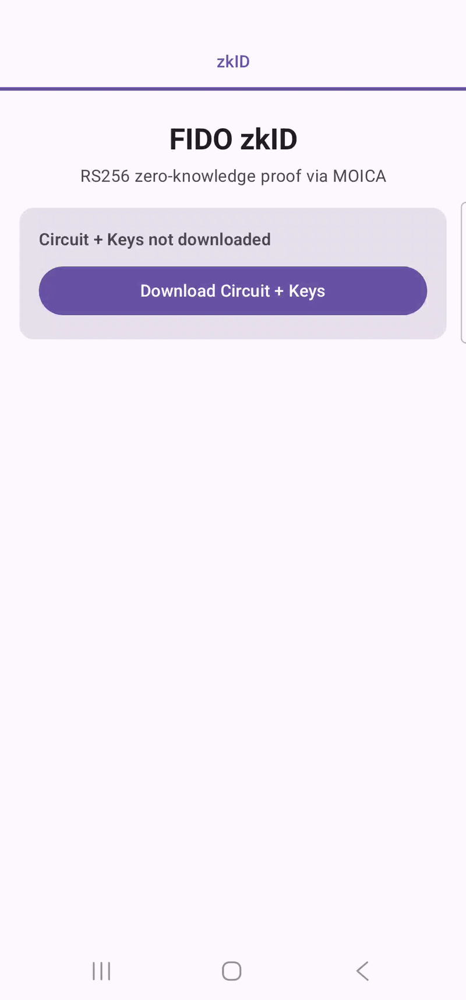
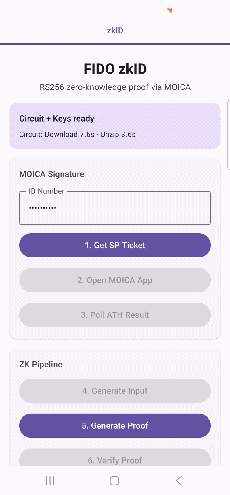
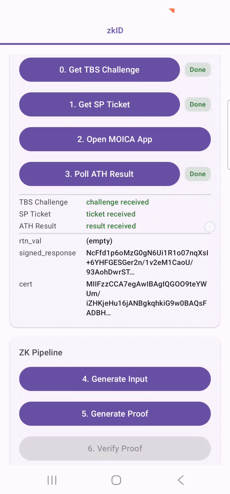
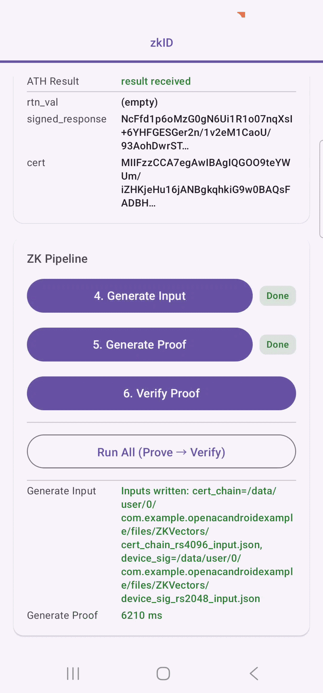

# OpenAC Android Example

An Android example app demonstrating zero-knowledge proof generation and verification using [OpenACKotlin](https://github.com/zkmopro/OpenACKotlin).

## Demo

| Download Circuit | TW FidO Signature |
|:---:|:---:|
|  |  |
| \~ 19 seconds | \~8 seconds |

| Generate Proof | Verify Proof |
|:---:|:---:|
|  |  |
| \~ 21 seconds | \~ 20 seconds |

## Overview

This app uses [OpenACKotlin](https://github.com/zkmopro/OpenACKotlin) to run the CertChain RS4096 + DeviceSig RS2048 ZK circuits on Android. The **zkID** tab exposes a scrollable screen with four cards that unlock sequentially:

### Circuit Download Card
Always visible. Shows a live progress bar and percentage while fetching. The MOICA and ZK Pipeline cards are hidden until the circuit keys and SMT snapshot are ready.

- **Download Circuit + Keys** — fetches and decompresses `cert_chain_rs4096_proving.key`, `device_sig_rs2048_proving.key`, and `g3-tree-snapshot.json.gz` from their CDNs; shows total download time on completion

### MOICA Signature Card *(visible after circuit + keys are ready)*
Enter a masked **ID Number**, then follow the four numbered steps:

- **0. Get TBS Challenge** — POSTs to the challenge server and stores the challenge bytes (`tbs`) and challenge ID
- **1. Get SP Ticket** — calls `getSpTicket` with the TBS as `signData`; enabled after a challenge is received
- **2. Open MOICA App** — launches the MOICA app via deep-link for the user to sign (app-to-app flow); enabled after an SP ticket is obtained
- **3. Poll ATH Result** — calls `getAthOrSignResult` and displays the signed response and cert snippets; enabled after an SP ticket is obtained

### circuit_input.json Card *(visible after Generate Input completes)*
Expandable card showing the generated circuit input JSON, with a copy-to-clipboard button.

### ZK Pipeline Card *(visible after circuit + keys are ready)*
- **4. Generate Input** — calls `generateCertChainRs4096Input` to produce the circuit input from the ATH result and SMT snapshot; enabled after ATH polling succeeds
- **5. Generate Proof** — calls `proveCertChainRs4096` and `proveDeviceSigRs2048` and reports total proof time (ms)
- **6. Verify Proof** — downloads verifying keys on demand, then POSTs the proof binaries to the link-verify server endpoint; enabled after prove succeeds
- **Run All (Prove → Verify)** — convenience button that runs steps 5–6 in sequence (Generate Input must be run separately first)

## Getting Started

Clone the repo and open it in Android Studio.

```bash
git clone https://github.com/zkmopro/OpenACAndroidExample
```

### Configuration — `Secrets.kt`

The app requires TW FidO SP service credentials. Create or update the file below **before building** (it is git-ignored):

```
app/src/main/java/com/example/openacandroidexample/Secrets.kt
```

```kotlin
package com.example.openacandroidexample

object Secrets {
    const val fidoSpServiceID: String = "your-sp-service-id"
    const val fidoAESKey: String = "your-32-byte-aes-key-base64"
}
```

| Constant | Description |
|---|---|
| `fidoSpServiceID` | SP service ID issued by MOICA for TW FidO |
| `fidoAESKey` | 32-byte AES-256 key (base64-encoded) used to compute `sp_checksum` via AES-256-GCM |

Credentials can also be supplied at test time via environment variables `FIDO_SP_SERVICE_ID` and `FIDO_AES_KEY`; the app falls back to `Secrets.kt` if those are absent.

The app requires an internet connection on first launch to download the circuit keys and SMT snapshot from the CDN.

## Architecture

| File | Description |
|---|---|
| `MainActivity.kt` | Entry point; wires the MOICA app2app callback URI into the ViewModel |
| `ProofViewModel.kt` | All state and business logic — download, MOICA API calls, ZK pipeline |
| `ZkIdComponent.kt` | Compose UI — circuit download card, MOICA signature card, circuit input JSON viewer card, ZK pipeline card |
| `FidoApi.kt` | MOICA TW FidO REST API client (`getSpTicket`, `getAthOrSignResult`, `pollSignResult`, `computeSpChecksum`) |
| `Secrets.kt` | Fallback SP service credentials (git-ignored) |

## Dependencies

- [OpenACKotlin](https://github.com/zkmopro/OpenACKotlin) — Kotlin bindings for the mopro ZK proving backend (`generateCertChainRs4096Input`, `proveCertChainRs4096`, `proveDeviceSigRs2048`)
